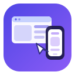

# Proto Studio

A ChatOSS app for designing **visual UI prototypes** — websites, tablet apps and phone apps — by talking to an AI Proto Agent, with a live device canvas you can review in desktop, tablet and phone frames.



## What it does

Three columns, one flow:

- **Projects** (left) — a library of prototypes: create, rename, duplicate and delete. Each project keeps its own design, device target and conversation.
- **Proto Agent** (middle) — describe what you want ("a pricing page for a coffee subscription", "an onboarding flow for a fitness app") and the agent writes a complete, self-contained HTML prototype. **Drop or paste reference images** — a screenshot, a competitor's page, a Figma export, a whiteboard sketch — and the agent designs from what it sees. Pick the model, watch it stream, and iterate.
- **Canvas** (right) — the prototype rendered inside real device chrome, with **Desktop (1440×900)**, **Tablet (834×1112)** and **Phone (390×844)** views, rotation, and Fit / 50 / 75 / 100% zoom.
- **Collapsible panels** — collapse the project list, the agent, or both (one button, or ⌘\) to give the prototype the whole window; a slim rail stays on screen so bringing them back is one click.

Also included:

- **Images that the agent can actually see** — dropped screenshots are downscaled and attached to your message as vision input; click any attached image to view it full size. Models that can't see images are flagged, with a one-click switch to one that can.
- **Code view** — read and hand-edit the prototype's HTML at any time. The app works fully by hand if you never ask the agent a thing.
- **Copy HTML** and **Save to Drive** — export the prototype as a standalone `.html` file.
- Prototypes are plain HTML/CSS/JS with no external requests, so they render fast and offline.

## Requirements

- ChatOSS desktop app (the app runs on the ChatOSS `.aip` runtime).

## Install

1. Download **`app-v1.0.0.aip`** (or the `.zip`) from the [latest release](../../releases/latest).
2. Drop it on ChatOSS's **Apps** app (or use *Install from file*).
3. Open **Proto Studio** from the dock.

## Permissions

Proto Studio declares only four capabilities:

| Capability | Used for |
| --- | --- |
| `chatApi` | The Proto Agent's model turns — no API keys, uses your ChatOSS models. |
| `fileDrop` | Dropping reference images onto the chat. Pasted images work through the normal clipboard paste event. |
| `clipboardWrite` | The "Copy HTML" button. |
| `drive` | "Save to Drive" — exports land in this app's ChatOSS Drive container, which your own cloud backup covers. |

Prototypes, projects, conversations and attached images are stored locally in the app's private scoped storage. Nothing is sent anywhere except your model turns.

## Development

Plain HTML/CSS/JS — no build step, no dependencies. Edit the files and republish:

```
app.json     manifest (id, capabilities, icon)
index.html   the three-column shell
style.css    layout, built on ChatOSS platform tokens/classes
app.js       state, agent turn loop + tools, device canvas
icon.svg     dock icon
```

Built with [ChatOSS.ai](https://chatoss.ai).
